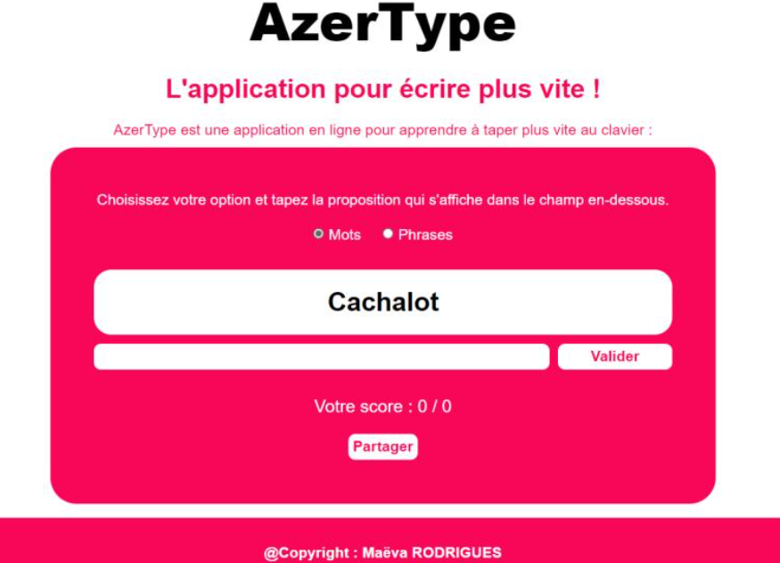

# ⌨️ Azertype : Application d’Entraînement à la Frappe

Conception d’une application web ludique qui aide les utilisateurs à augmenter leur vitesse de frappe au clavier grâce à des exercices interactifs et des jeux de dactylographie.

## 🌐 Technologies appliquées

- 
- 
- 

## 🛠️ Outils

- 

## 📷 Captures d’écran

## 🔗 Liens vers la démo

